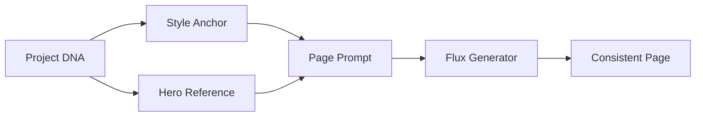

# Style System

## Overview

The style system ensures consistent visual output across all pages in a project by:
1. Locking "Project DNA" at creation
2. Generating style calibration samples
3. Using the selected anchor for all generations

---

## Project DNA

When a project is created, these attributes are **locked** and cannot be changed:

| Attribute | Options | Impact |
|-----------|---------|--------|
| Audience | toddler, children, tween, teen, adult | Line weight, complexity, **safety level** |
| Style Preset | bold-simple, kawaii, whimsical, cartoon, botanical | Visual style |
| Trim Size | 8.5×11, 8.5×8.5, 6×9 | Aspect ratio |
| Page Count | 1-45 | Book length |

### Derived Attributes

From `audience`, we automatically derive:

```typescript
const AUDIENCE_DERIVATIONS = {
  toddler:  { lineWeight: 'thick', complexity: 'minimal', safetyLevel: 'strict', maxElements: 5 },
  children: { lineWeight: 'thick', complexity: 'moderate', safetyLevel: 'strict', maxElements: 10 },
  tween:    { lineWeight: 'medium', complexity: 'moderate', safetyLevel: 'moderate', maxElements: 15 },
  teen:     { lineWeight: 'medium', complexity: 'detailed', safetyLevel: 'moderate', maxElements: 20 },
  adult:    { lineWeight: 'fine', complexity: 'intricate', safetyLevel: 'standard', maxElements: 30 },
};
```

---

## Style Presets

### 1. Bold & Simple
- Thick outlines (8px+)
- Minimal detail
- Clean shapes
- Best for: Toddler, Children

### 2. Kawaii Cute
- Round shapes
- Big eyes
- Soft curves
- Best for: Children, Tween

### 3. Whimsical Fantasy
- Flowing lines
- Magical elements
- Organic curves
- Best for: Children, Tween, Teen

### 4. Cartoon Classic
- Traditional animation style
- Clear expressions
- Dynamic poses
- Best for: All ages

### 5. Nature Botanical
- Organic shapes
- Plant and flower focus
- Detailed patterns
- Best for: Teen, Adult

---

## Style Calibration (Flux-Powered)

### Process

```
User provides: "cute forest animals"
     │
     ▼
Generate 4 variations with Flux:
├── Sample 1: balanced interpretation
├── Sample 2: more detailed
├── Sample 3: simpler, bolder
└── Sample 4: more playful
     │
     ▼
User selects preferred sample
     │
     ▼
Selected image becomes "Style Anchor"
     │
     ▼
Anchor description extracted via GPT-4o-mini
     │
     ▼
All future pages reference anchor style
```

### Flux Configuration for Calibration

```typescript
// Generate 4 style samples
const VARIATIONS = [
  'balanced interpretation',
  'more detailed with decorative accents',
  'simpler with bolder shapes',
  'more playful with curved lines',
];

// Each sample is 512×512 for quick preview
const calibrationConfig = {
  fluxModel: 'flux-lineart',  // Cost effective
  width: 512,
  height: 512,
  numInferenceSteps: 28,
};
```

### Cost: 10 Blots (4 samples)

---

## Line Weight Prompts

These are injected into Flux prompts based on audience:

```typescript
const LINE_WEIGHT_PROMPTS = {
  thick: 'bold thick black outlines, 6-8 pixel line weight, chunky shapes, prominent lines',
  medium: 'clean medium black outlines, 3-5 pixel line weight, balanced detail',
  fine: 'delicate fine black outlines, 1-3 pixel line weight, intricate details',
};
```

---

## Complexity Prompts

```typescript
const COMPLEXITY_PROMPTS = {
  minimal: '3-5 main elements only, large simple shapes, maximum white space',
  moderate: '5-10 elements, some decorative detail, balanced composition',
  detailed: '10-20 elements, patterns and decorative elements',
  intricate: '20+ elements, fine patterns, mandala-level detail',
};
```

---

## Hero Reference Sheets

Heroes provide character consistency across all pages.

### Generation Process

```
User provides:
├── Name: "Bella"
├── Description: "friendly white bunny with floppy ears"
└── Audience: "children"
     │
     ▼
Safety check on description (for audience)
     │
     ▼ (if passed)
Generate 2×2 reference sheet with Flux Pro:
├── Front view
├── Side view
├── Back view
└── 3/4 view
     │
     ▼
Store reference (1536×1536)
Generate thumbnail (256×256)
```

### Flux Pro for Heroes

We use `flux-pro` ($0.04/image) for hero sheets because:
- Highest quality output
- Character consistency across views
- Only generated once per hero

### Cost: 15 Blots

---

## Style Consistency Flow



Every page generation receives:
1. **Line weight** from audience
2. **Complexity** from audience
3. **Style description** from anchor
4. **Hero description** (if hero selected)
5. **Safety rules** from audience

---

## Visual Consistency Checklist

Before export, all pages should have:

| Check | Requirement |
|-------|-------------|
| Line weight | Consistent across all pages |
| Complexity | Matches audience setting |
| Hero appearance | Matches reference sheet |
| White space | Appropriate for age group |
| Content safety | Passes audience safety level |
