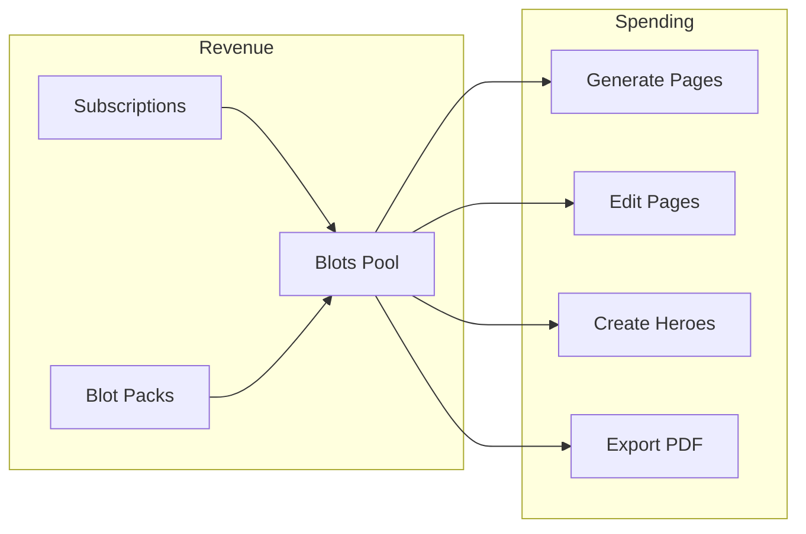

# Billing & Blots

## Overview



---

## Currency: Blots

| Attribute | Value |
|-----------|-------|
| Name | Blots |
| Symbol | 🎨 (optional) |
| Display | Always in header |
| Pool | Single (subscription + packs combined) |

### Blot Costs (REVISED ✅)

| Action | Blots | Your Cost (USD) |
|--------|-------|-----------------|
| Generate 1 page | **5** | ~$0.013 |
| Edit 1 page | **5** | ~$0.013 |
| Style calibration (4 samples) | **4** | ~$0.05 |
| Hero Reference Sheet | **8** | ~$0.04 |
| Cover generation | **6** | ~$0.02 |
| Export PDF | **FREE** | ~$0.01 |

### Full 40-Page Book

| Component | Blots |
|-----------|-------|
| 40 pages @ 5 Blots | 200 |
| Calibration | 4 |
| Hero sheet | 8 |
| Export | FREE |
| **TOTAL** | **212 Blots** |

---

## Subscription Tiers (REVISED ✅)

| Plan | Price (USD) | Blots/mo | Storage | Books/Mo | Commercial |
|------|-------------|----------|---------|----------|------------|
| **Free** | $0 | 50 | 1 GB | Trial | ❌ |
| **Starter** | **$9/mo** | **250** | 5 GB | ~1 | ✅ |
| **Creator** | **$24/mo** | **800** | 15 GB | ~3-4 | ✅ |
| **Pro** | **$59/mo** | **2,500** | 50 GB | ~11 | ✅ |

### Yearly Pricing (2 months free)

| Plan | Monthly | Yearly | Savings |
|------|---------|--------|---------|
| Starter | $9/mo | $90/yr | $18 |
| Creator | $24/mo | $240/yr | $48 |
| Pro | $59/mo | $590/yr | $118 |

### Subscription Rules

- Blots **RESET** monthly (no rollover in v1)
- Storage is cumulative (doesn't reset)
- Downgrade: immediate access reduction
- Upgrade: immediate access increase + prorated charge

---

## Blot Packs (One-Time Purchases) ✅ NEW

### Available Packs

| Pack | Blots | Price | Per-Blot | Per-Book |
|------|-------|-------|----------|----------|
| **Splash** 💧 | 100 | $4 | $0.040 | ~$8.56 |
| **Bucket** 🪣 | 350 | $12 | $0.034 | ~$7.34 |
| **Barrel** 🛢️ | 1,200 | $35 | $0.029 | ~$6.24 |

### Pack Rules

- **Never expire** (user-friendly)
- **Single pool** (combined with subscription Blots)
- **Stack** with subscription (buy packs even if subscribed)
- **No refunds** (Stripe handles this)

### Design Rationale

1. **Packs cost MORE per-Blot than subscriptions** → Won't cannibalize subscriptions
2. **Solve the "50 Blots short" problem** → Users can finish projects
3. **Simple single pool** → No complex tracking
4. **Never expire** → User-friendly, no pressure

---

## Stripe Configuration

### Products to Create

#### Subscriptions (mode: subscription)

```
Product: Myjoe Starter
├── Price: $9/month (recurring, monthly)
└── Price: $90/year (recurring, yearly)

Product: Myjoe Creator
├── Price: $24/month (recurring, monthly)
└── Price: $240/year (recurring, yearly)

Product: Myjoe Pro
├── Price: $59/month (recurring, monthly)
└── Price: $590/year (recurring, yearly)
```

#### Blot Packs (mode: payment)

```
Product: Blot Pack - Splash
├── Price: $4 (one-time)
└── Metadata: { blots: 100, type: 'blot_pack' }

Product: Blot Pack - Bucket
├── Price: $12 (one-time)
└── Metadata: { blots: 350, type: 'blot_pack' }

Product: Blot Pack - Barrel
├── Price: $35 (one-time)
└── Metadata: { blots: 1200, type: 'blot_pack' }
```

### Environment Variables

```bash
# Subscription Prices
STRIPE_PRICE_STARTER_MONTHLY=price_xxx
STRIPE_PRICE_STARTER_YEARLY=price_xxx
STRIPE_PRICE_CREATOR_MONTHLY=price_xxx
STRIPE_PRICE_CREATOR_YEARLY=price_xxx
STRIPE_PRICE_PRO_MONTHLY=price_xxx
STRIPE_PRICE_PRO_YEARLY=price_xxx

# Blot Pack Prices
STRIPE_PRICE_SPLASH=price_xxx
STRIPE_PRICE_BUCKET=price_xxx
STRIPE_PRICE_BARREL=price_xxx
```

---

## Database Schema

### blot_purchases Table

```sql
CREATE TABLE blot_purchases (
  id UUID PRIMARY KEY DEFAULT gen_random_uuid(),
  owner_id UUID REFERENCES auth.users(id) ON DELETE CASCADE,
  pack_id TEXT NOT NULL,          -- 'splash', 'bucket', 'barrel'
  blots INTEGER NOT NULL,         -- 100, 350, 1200
  price_cents INTEGER NOT NULL,   -- 400, 1200, 3500
  stripe_session_id TEXT,
  created_at TIMESTAMPTZ DEFAULT NOW()
);

CREATE INDEX idx_blot_purchases_owner ON blot_purchases(owner_id);

-- RLS
ALTER TABLE blot_purchases ENABLE ROW LEVEL SECURITY;

CREATE POLICY "Users can view own purchases"
  ON blot_purchases FOR SELECT
  USING (auth.uid() = owner_id);
```

### Profile Blot Fields

```sql
-- In profiles table
blots INTEGER DEFAULT 50,
blots_reset_at TIMESTAMPTZ,
```

---

## Implementation

### Checkout Flow

```typescript
// src/server/billing/stripe.ts
import Stripe from 'stripe';

const stripe = new Stripe(process.env.STRIPE_SECRET_KEY!);

const SUBSCRIPTION_PRICES = {
  starter: {
    monthly: process.env.STRIPE_PRICE_STARTER_MONTHLY!,
    yearly: process.env.STRIPE_PRICE_STARTER_YEARLY!,
  },
  creator: {
    monthly: process.env.STRIPE_PRICE_CREATOR_MONTHLY!,
    yearly: process.env.STRIPE_PRICE_CREATOR_YEARLY!,
  },
  pro: {
    monthly: process.env.STRIPE_PRICE_PRO_MONTHLY!,
    yearly: process.env.STRIPE_PRICE_PRO_YEARLY!,
  },
};

const PACK_PRICES = {
  splash: { priceId: process.env.STRIPE_PRICE_SPLASH!, blots: 100 },
  bucket: { priceId: process.env.STRIPE_PRICE_BUCKET!, blots: 350 },
  barrel: { priceId: process.env.STRIPE_PRICE_BARREL!, blots: 1200 },
};

export async function createSubscriptionCheckout(
  userId: string,
  email: string,
  plan: 'starter' | 'creator' | 'pro',
  interval: 'monthly' | 'yearly'
): Promise<string> {
  let customerId = await getStripeCustomerId(userId);
  
  if (!customerId) {
    const customer = await stripe.customers.create({ email, metadata: { userId } });
    customerId = customer.id;
    await saveStripeCustomerId(userId, customerId);
  }
  
  const session = await stripe.checkout.sessions.create({
    mode: 'subscription',
    customer: customerId,
    line_items: [{
      price: SUBSCRIPTION_PRICES[plan][interval],
      quantity: 1,
    }],
    metadata: { userId, plan, interval, type: 'subscription' },
    success_url: `${process.env.NEXT_PUBLIC_APP_URL}/billing?success=subscription`,
    cancel_url: `${process.env.NEXT_PUBLIC_APP_URL}/billing?canceled=true`,
  });
  
  return session.url!;
}

export async function createPackCheckout(
  userId: string,
  email: string,
  packId: 'splash' | 'bucket' | 'barrel'
): Promise<string> {
  const pack = PACK_PRICES[packId];
  
  const session = await stripe.checkout.sessions.create({
    mode: 'payment',
    customer_email: email,
    line_items: [{
      price: pack.priceId,
      quantity: 1,
    }],
    metadata: { 
      userId, 
      packId, 
      blots: pack.blots.toString(),
      type: 'blot_pack'
    },
    success_url: `${process.env.NEXT_PUBLIC_APP_URL}/billing?success=pack&blots=${pack.blots}`,
    cancel_url: `${process.env.NEXT_PUBLIC_APP_URL}/billing?canceled=true`,
  });
  
  return session.url!;
}
```

### Webhook Handler

```typescript
// src/app/api/webhooks/stripe/route.ts
import { PLAN_LIMITS } from '@/lib/constants';

export async function POST(request: Request) {
  const body = await request.text();
  const signature = request.headers.get('stripe-signature')!;
  
  const event = stripe.webhooks.constructEvent(
    body,
    signature,
    process.env.STRIPE_WEBHOOK_SECRET!
  );
  
  switch (event.type) {
    case 'checkout.session.completed': {
      const session = event.data.object as Stripe.Checkout.Session;
      const { userId, type } = session.metadata || {};
      
      if (type === 'subscription') {
        const { plan } = session.metadata!;
        const limits = PLAN_LIMITS[plan as keyof typeof PLAN_LIMITS];
        
        await updateProfile(userId, {
          plan,
          blots: limits.blots,
          storage_limit_bytes: limits.storageBytes,
          blots_reset_at: getNextResetDate(),
          stripe_customer_id: session.customer as string,
          stripe_subscription_id: session.subscription as string,
        });
      } else if (type === 'blot_pack') {
        const { packId, blots } = session.metadata!;
        
        // Add blots to user
        await addBlots(userId, parseInt(blots));
        
        // Record purchase
        await recordPackPurchase(userId, {
          packId,
          blots: parseInt(blots),
          priceCents: session.amount_total!,
          stripeSessionId: session.id,
        });
      }
      break;
    }
    
    case 'invoice.payment_succeeded': {
      const invoice = event.data.object as Stripe.Invoice;
      if (invoice.billing_reason === 'subscription_cycle') {
        const customerId = invoice.customer as string;
        const profile = await getProfileByStripeCustomer(customerId);
        const limits = PLAN_LIMITS[profile.plan as keyof typeof PLAN_LIMITS];
        
        await updateProfile(profile.owner_id, {
          blots: limits.blots,
          blots_reset_at: getNextResetDate(),
          payment_failed_at: null,
        });
      }
      break;
    }
    
    case 'invoice.payment_failed': {
      const invoice = event.data.object as Stripe.Invoice;
      const customerId = invoice.customer as string;
      const profile = await getProfileByStripeCustomer(customerId);
      
      await updateProfile(profile.owner_id, {
        payment_failed_at: new Date().toISOString(),
      });
      break;
    }
    
    case 'customer.subscription.deleted': {
      const subscription = event.data.object as Stripe.Subscription;
      const customerId = subscription.customer as string;
      const profile = await getProfileByStripeCustomer(customerId);
      
      await updateProfile(profile.owner_id, {
        plan: 'free',
        blots: PLAN_LIMITS.free.blots,
        storage_limit_bytes: PLAN_LIMITS.free.storageBytes,
        stripe_subscription_id: null,
      });
      break;
    }
  }
  
  return Response.json({ received: true });
}
```

---

## UI Components

### Blot Pack Selector

```typescript
// src/components/features/billing/blot-pack-selector.tsx
const PACKS = [
  { id: 'splash', name: 'Splash', emoji: '💧', blots: 100, price: 4 },
  { id: 'bucket', name: 'Bucket', emoji: '🪣', blots: 350, price: 12, popular: true },
  { id: 'barrel', name: 'Barrel', emoji: '🛢️', blots: 1200, price: 35, bestValue: true },
];

export function BlotPackSelector() {
  const [loading, setLoading] = useState<string | null>(null);
  
  const handlePurchase = async (packId: string) => {
    setLoading(packId);
    const res = await fetch('/api/billing/pack-checkout', {
      method: 'POST',
      body: JSON.stringify({ packId }),
    });
    const { checkoutUrl } = await res.json();
    window.location.href = checkoutUrl;
  };
  
  return (
    <div className="grid grid-cols-3 gap-4">
      {PACKS.map((pack) => (
        <div
          key={pack.id}
          className="relative bg-zinc-900 border border-zinc-800 rounded-lg p-4 text-center"
        >
          {pack.popular && (
            <span className="absolute -top-2 left-1/2 -translate-x-1/2 bg-blue-600 text-xs px-2 py-0.5 rounded">
              Popular
            </span>
          )}
          {pack.bestValue && (
            <span className="absolute -top-2 left-1/2 -translate-x-1/2 bg-green-600 text-xs px-2 py-0.5 rounded">
              Best Value
            </span>
          )}
          
          <div className="text-4xl mb-2">{pack.emoji}</div>
          <div className="text-lg font-semibold">{pack.name}</div>
          <div className="text-2xl font-bold text-blue-400">{pack.blots}</div>
          <div className="text-sm text-zinc-400 mb-4">Blots</div>
          
          <Button
            onClick={() => handlePurchase(pack.id)}
            loading={loading === pack.id}
            className="w-full"
          >
            ${pack.price}
          </Button>
        </div>
      ))}
    </div>
  );
}
```

---

## Blot Deduction Logic

```typescript
// src/server/billing/blots.ts

export async function deductBlots(
  userId: string, 
  amount: number,
  action: string
): Promise<{ success: boolean; remaining: number }> {
  const profile = await getProfile(userId);
  
  if (profile.blots < amount) {
    return { success: false, remaining: profile.blots };
  }
  
  const newBalance = profile.blots - amount;
  await updateProfile(userId, { blots: newBalance });
  
  return { success: true, remaining: newBalance };
}

export async function checkBlotBalance(
  userId: string,
  required: number
): Promise<{ sufficient: boolean; current: number; required: number }> {
  const profile = await getProfile(userId);
  
  return {
    sufficient: profile.blots >= required,
    current: profile.blots,
    required,
  };
}
```

---

## Revenue Projections

### Monthly Revenue Model

| Subscribers | Revenue | Fixed Costs | Variable | Net Profit |
|-------------|---------|-------------|----------|------------|
| 25 | ~$500 | $87 | ~$50 | ~$363 |
| 50 | ~$1,000 | $87 | ~$100 | ~$813 |
| 100 | ~$2,000 | $87 | ~$200 | ~$1,713 |
| 500 | ~$10,000 | $200 | ~$1,000 | ~$8,800 |

### Blot Pack Revenue (Estimate)

| Adoption | Pack Sales/Mo | Revenue |
|----------|---------------|---------|
| 10% | ~10 packs | ~$120 |
| 15% | ~15 packs | ~$180 |
| 20% | ~20 packs | ~$240 |

---

## Edge Cases

### Scenario: User runs out mid-generation

```
- Creator plan: 800 Blots/month
- User starts 40-page job (200 Blots required)
- User has 180 Blots
→ Job rejected BEFORE starting
→ Show: "Need 20 more Blots. Buy a Splash pack?"
```

### Scenario: Pack + Subscription stacking

```
- Pro plan: 2,500 Blots/month
- User buys Barrel pack: +1,200 Blots
- Total available: 3,700 Blots
- Renewal hits: Reset to 2,500 (pack Blots preserved? NO - simplified single pool)
```

**Decision:** Subscription reset replaces ALL Blots. Packs are best bought when running low.
