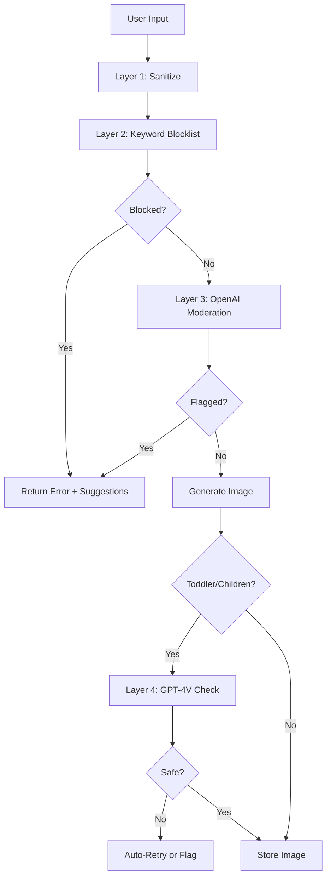

# Security & Controls

## Authentication

### Supported Methods

| Method | Provider | Use Case |
|--------|----------|----------|
| Google OAuth | Supabase Auth | Primary (fastest) |
| Magic Link | Supabase Auth | Alternative |

### Auth Flow

```
User visits /login → Google OAuth → /auth/callback → Profile created → /studio
```

---

## Content Safety System (NEW)

### Multi-Layer Safety



### Safety Levels by Audience

| Audience | Safety Level | Violence | Sexual | Notes |
|----------|--------------|----------|--------|-------|
| Toddler (2-4) | STRICT | 0.05 | 0.01 | Most restrictive |
| Children (5-8) | STRICT | 0.10 | 0.05 | Very restrictive |
| Tween (9-12) | MODERATE | 0.20 | 0.10 | Balanced |
| Teen (13-17) | MODERATE | 0.30 | 0.15 | Relaxed |
| Adult (18+) | STANDARD | 0.50 | 0.30 | Least restrictive |

**sexual/minors threshold: ALWAYS 0.01** (never allow)

### Forbidden Content Examples

**Toddler (BLOCKED):**
- scary, monster, weapon, ghost, skeleton
- fire, explosion, blood, violence
- crying, sad, angry, nightmare

**Children (BLOCKED):**
- zombie, gore, horror, death
- realistic weapons, drug, alcohol

**Adult (BLOCKED):**
- explicit sexual, CSAM, hate symbols
- extremist propaganda, drug manufacturing

### Implementation

```typescript
// src/server/ai/content-safety.ts
export async function checkContentSafety(
  input: string, 
  audience: Audience
): Promise<SafetyResult> {
  // Layer 1: Sanitize input
  const sanitized = sanitizePrompt(input);
  
  // Layer 2: Keyword blocklist (instant, free)
  const blocked = checkKeywordBlocklist(sanitized, audience);
  if (blocked.length > 0) {
    return { safe: false, blocked, suggestions: getSuggestions(audience) };
  }
  
  // Layer 3: OpenAI Moderation API (free)
  const modResult = await openai.moderations.create({ input: sanitized });
  const violations = checkThresholds(modResult, audience);
  if (violations.length > 0) {
    return { safe: false, blocked: violations, suggestions: getSuggestions(audience) };
  }
  
  return { safe: true, blocked: [] };
}
```

### Post-Generation Safety (GPT-4V)

For toddler and children audiences, generated images are scanned:

```typescript
// src/server/ai/image-safety-check.ts
export async function checkGeneratedImageSafety(
  imageUrl: string,
  audience: Audience
): Promise<ImageSafetyResult> {
  // Only run for strict audiences
  if (!['toddler', 'children'].includes(audience)) {
    return { safe: true, issues: [], recommendation: 'approve' };
  }
  
  // GPT-4V visual inspection
  const response = await openai.chat.completions.create({
    model: 'gpt-4o',
    messages: [
      { role: 'system', content: safetyPrompt },
      { role: 'user', content: [{ type: 'image_url', image_url: { url: imageUrl } }] }
    ],
    response_format: { type: 'json_object' },
  });
  
  return JSON.parse(response.choices[0].message.content);
}
```

---

## Row Level Security (RLS)

**CRITICAL: Every table with user data MUST have RLS enabled**

### RLS Checklist

| Table | RLS | Policy |
|-------|-----|--------|
| `profiles` | ✅ | Own profile only |
| `projects` | ✅ | Own projects only |
| `heroes` | ✅ | Own heroes only |
| `pages` | ✅ | Via project ownership |
| `page_versions` | ✅ | Via page → project |
| `jobs` | ✅ | Own jobs only |
| `job_items` | ✅ | Via job ownership |
| `assets` | ✅ | Own assets only |
| `blot_purchases` | ✅ | Own purchases only |
| `global_config` | ✅ | Read-only for all |

---

## Rate Limiting

### Limits by Resource

| Resource | Limit | Window | Scope |
|----------|-------|--------|-------|
| API requests | 100 | 1 min | Per user |
| Generation jobs | 5 | 1 min | Per user |
| Page edits | 20 | 1 min | Per user |
| Export requests | 10 | 1 hour | Per user |
| Login attempts | 5 | 15 min | Per IP |

---

## Input Validation

### API Request Validation with Zod

```typescript
export const CreateProjectSchema = z.object({
  name: z.string().min(1).max(100),
  pageCount: z.number().int().min(1).max(45),
  audience: z.enum(['toddler', 'children', 'tween', 'teen', 'adult']),
  stylePreset: z.enum(['bold-simple', 'kawaii', 'whimsical', 'cartoon', 'botanical']),
  trimSize: z.enum(['8.5x11', '8.5x8.5', '6x9']).default('8.5x11'),
  heroId: z.string().uuid().nullable().optional(),
});

export const GenerateSchema = z.object({
  projectId: z.string().uuid(),
  idea: z.string().min(3).max(500), // Max 500 chars for safety
  pageNumbers: z.array(z.number().int().positive()).optional(),
});
```

---

## Kill Switches

### Global Config Table

```sql
-- Disable generation immediately
UPDATE global_config SET value = 'false' WHERE key = 'generation_enabled';

-- Enable generation
UPDATE global_config SET value = 'true' WHERE key = 'generation_enabled';
```

### Available Switches

| Key | Effect |
|-----|--------|
| `generation_enabled` | Enable/disable image generation |
| `export_enabled` | Enable/disable PDF export |
| `signup_enabled` | Enable/disable new signups |
| `maintenance_mode` | Show maintenance page |

---

## Environment Variables Security

| Rule | Implementation |
|------|----------------|
| Never in code | Use `.env.local` |
| Never in git | Add to `.gitignore` |
| Production | Vercel Dashboard |
| Service keys | Never `NEXT_PUBLIC_` |

```bash
# Public (safe for client)
NEXT_PUBLIC_SUPABASE_URL=
NEXT_PUBLIC_SUPABASE_ANON_KEY=
NEXT_PUBLIC_STRIPE_PUBLISHABLE_KEY=

# Private (server only)
SUPABASE_SERVICE_ROLE_KEY=     # DANGER: Full DB access
STRIPE_SECRET_KEY=             # Payment processing
OPENAI_API_KEY=                # AI generation + moderation
REPLICATE_API_TOKEN=           # Flux generation
R2_ACCESS_KEY_ID=              # Storage
R2_SECRET_ACCESS_KEY=          # Storage
```

---

## Account Deletion

### Why Disable Instead of Delete Auth?

Prevents free tier abuse:
1. User signs up (free 50 Blots)
2. User uses Blots
3. User deletes account
4. User signs up again (free 50 Blots)
5. Repeat

With `disabled_at`, the email is blacklisted and can't re-register.

---

## Security Headers

```typescript
// next.config.js
const securityHeaders = [
  { key: 'X-DNS-Prefetch-Control', value: 'on' },
  { key: 'Strict-Transport-Security', value: 'max-age=63072000; includeSubDomains; preload' },
  { key: 'X-Content-Type-Options', value: 'nosniff' },
  { key: 'X-Frame-Options', value: 'DENY' },
  { key: 'X-XSS-Protection', value: '1; mode=block' },
  { key: 'Referrer-Policy', value: 'origin-when-cross-origin' },
];
```
